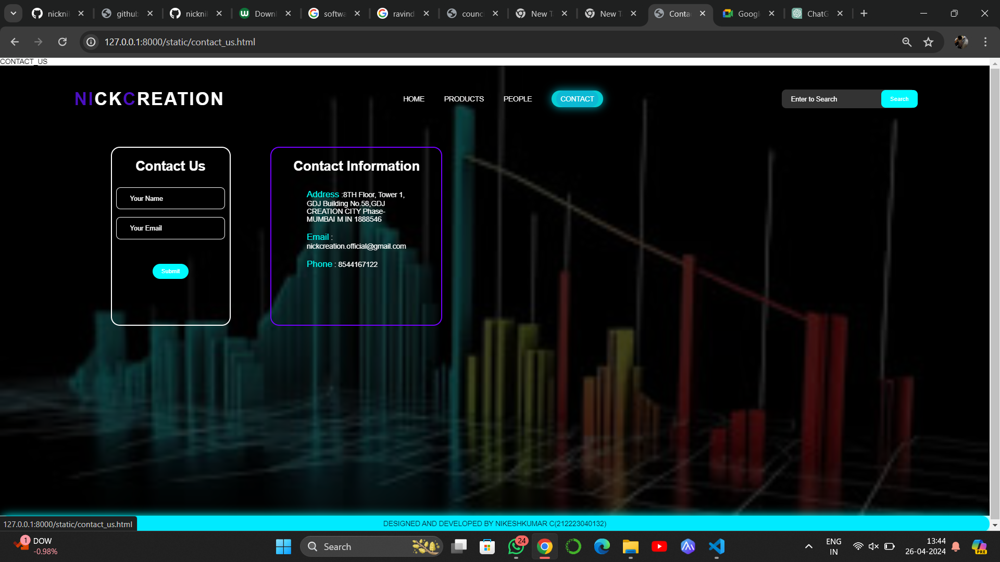

# Ex.07 Software Product Company Website
## Date:21-04-2024

## AIM:
To develop a static company website to display the softwares and services provided by the company.

## DESIGN STEPS:

### Step 1:
Requirement collection.

### Step 2:
Creating the layout using HTML and CSS.

### Step 3:
Updating the sample content.

### Step 4:
Choose the appropriate style and color scheme.

### Step 5:
Validate the layout in various browsers.

### Step 6:
Validate the HTML code.

### Step 7:
Publish the website in the given URL.

## PROGRAM:
home.html
```
<html>
  <head>
    <meta name="viewport" content="width=device-width, initial-scale=1.0" />
    <title>ASTROGLOW SOFTWARE DEVELOPEMENT COMPANY</title>
    <style type="text/css">
      * {
        margin: 0;
        padding: 0;
        font-family: Arial, Helvetica, sans-serif;
      }
      .banner {
        width: 100%;
        height: 95vh;
        background-image: linear-gradient(
            rgba(9, 2, 2, 0.75),
            rgba(0, 0, 0, 0.75)
          ),
          url( nikesh\ web\ background.jpeg );
        background-size: cover;
        background-position: center;
      }
      .navbar {
        width: 85%;
        margin: auto;
        padding: 35px 0;
        display: flex;
        align-items: center;
        justify-content: space-between;
      }
      .logo {
        color: #770bfb;
        font-size: 40px;
        font-weight: 700;
        letter-spacing: 3px;
      }
      span {
        color: rgb(24, 150, 196);
      }
      form {
        width: 300px;
        height: 40px;
        display: flex;
        background: rgba(255, 255, 255, 0.2);
        padding: 1px 1px;
        font-size: 15px;
        border-radius: 10px;
        backdrop-filter: blur(4px) saturate(180%);
      }
      form input {
        background: transparent;
        flex: 1;
        border: 0;
        outline: none;
        padding: 12px 20px;
        font-size: 15px;
        color: rgb(11, 109, 154);
      }
      ::placeholder {
        color: white;
      }
      form button {
        border: 0;
        outline: none;
        padding: 5px 20px;
        color: white;
        border-radius: 10px;
        background: #00d5ff;
        cursor: pointer;
      }
      #search.hover {
        border: 1px;
        padding: 10px;

        transition: 0.5s;
        cursor: pointer;
        border-radius: 30px;
        background: #0ef;
        color: #081b29;
        box-shadow: 0 0 20px #0ef;
      }
      .navbar li {
        list-style: none;
        display: inline-block;
        margin: 0 20px;
        position: relative;
      }
      .navbar li a {
        text-decoration: none;
        color: white;
        text-transform: uppercase;
      }
      .navbar li:hover {
        border: 1px;
        padding: 10px;

        transition: 0.5s;
        cursor: pointer;
        border-radius: 30px;
        background: rgb(26, 219, 226);
        color: #081b29;
        box-shadow: 0 0 20px rgb(0, 238, 255);
      }
      .content {
        color: rgb(17, 206, 223);
        position: absolute;
        top: 50%;
        left: 50%;
        transform: translate(-50%, -50%);
        text-align: center;
      }
      .text h2 {
        color: rgb(219, 189, 15);
        font-weight: 800;
        font-size: 50px;
        letter-spacing: 3px;
      }
      .text p {
        color: rgb(18, 214, 218);
        text-transform: capitalize;
        font-size: 15px;
        margin-bottom: 30px;
        word-spacing: 2px;
        letter-spacing: 1px;
      }
      .login {
        margin: 0px 10px;
        border: 2px solid red;
        padding: 13px 35px;
        letter-spacing: 1px;
        color: white;
        border-radius: 30px;
        background-color: red;
        text-decoration: none;
      }
      .login:hover {
        border: 2px solid red;
        color: red;
        background-color: white;
        transition: 0.5s;
        cursor: pointer;
      }
      .signup {
        margin: 0px 10px;
        border: 2px solid green;
        padding: 13px 35px;
        letter-spacing: 1px;
        color: white;
        border-radius: 30px;
        background-color: green;
        text-decoration: none;
      }
      .signup:hover {
        border: 2px solid green;
        color: green;
        background-color: white;
        transition: 0.5s;
        cursor: pointer;
      }
      footer {
        border: 1px;
        padding: 10px;

        transition: 0.5s;
        cursor: pointer;
        border-radius: 30px;
        background: rgb(0, 242, 255);
        color: #081b29;
        box-shadow: 0 0 20px rgb(0, 255, 251);
      }
    </style>
  </head>
  <body>
    <div class="banner">
      <br />
      <div class="navbar">
        <h1 class="logo">NI<span>CK</span>C<span>REATION</span></h1>
        <ul>
          <li><a href="home.html"> Home </a></li>
          <li><a href="products.html"> Products </a></li>
          <li><a href="people.html"> people </a></li>
          <li><a href="contact_us.html"> Contact_us </a></li>
        </ul>
        <form action="" method="get">
          <input type="text" placeholder="Enter to Search" />
          <button id="search" type="submit">Search</button>
        </form>
      </div>
      <div class="content">
        <div class="text">
          <h2>
            "Integrating the virtual assistant with popular business tools such as customer relationship management (CRM) systems" 
          </h2>
          <br />

          <br />
          <div>
            <a href="#" class="login"> Log In </a>
            <a href="#" class="signup"> Sign Up </a>
          </div>
        </div>
      </div>
    </div>
    <footer>
      <center>DESIGNED AND DEVELOPED BY NIKESHKUMAR C(212223040132)</center>
    </footer>
  </body>
</html>
```
products.html
```
PRODUCT
<html>
  <head>
    <meta name="viewport" content="width=device-width, initial-scale=1.0" />
    <title>Products Page</title>
    <style type="text/css">
      * {
        margin: 0;
        padding: 0;
        font-family: Arial, Helvetica, sans-serif;
      }
      .banner {
        width: 100%;
        height: 95vh;
        background-image: linear-gradient(
            rgba(0, 0, 0, 0.75),
            rgba(0, 0, 0, 0.75)
          ),
          url(nikesh\ web\ background.jpeg );
        background-size: cover;
        background-position: center;
      }
      .navbar {
        width: 85%;
        margin: auto;
        padding: 35px 0;
        display: flex;
        align-items: center;
        justify-content: space-between;
      }
      .bg-product {
        border: 1px;
        padding: 10px;
        color: white;
        background-color: rgb(0, 238, 255);
        border-radius: 30px;
      }
      .logo {
        color: #5f0bfb;
        font-size: 40px;
        font-weight: 700;
        letter-spacing: 3px;
      }
      span {
        color: white;
      }
      form {
        width: 300px;
        height: 40px;
        display: flex;
        background: rgba(255, 255, 255, 0.2);
        padding: 1px 1px;
        font-size: 15px;
        border-radius: 10px;
        backdrop-filter: blur(4px) saturate(180%);
      }
      form input {
        background: transparent;
        flex: 1;
        border: 0;
        outline: none;
        padding: 12px 20px;
        font-size: 15px;
        color: white;
      }
      ::placeholder {
        color: white;
      }
      form button {
        border: 0;
        outline: none;
        padding: 5px 20px;
        color: white;
        border-radius: 10px;
        background: rgb(0, 213, 255);
        cursor: pointer;
      }
      .navbar li {
        list-style: none;
        display: inline-block;
        margin: 0 20px;
        position: relative;
      }
      .navbar li a {
        text-decoration: none;
        color: white;
        text-transform: uppercase;
      }
      .navbar li:hover {
        border: 1px;
        padding: 10px;

        transition: 0.5s;
        cursor: pointer;
        border-radius: 30px;
        background: rgb(0, 251, 255);
        color: #081b29;
        box-shadow: 0 0 20px rgb(0, 225, 255);
      }
      .container {
        background: transparent;
        padding: 10px 5%;
        padding-bottom: 100px;
      }
      .container .box-container {
        display: grid;
        grid-template-columns: repeat(auto-fit, minmax(170px, 1fr));
        gap: 100px;
      }
      .container .box-container .box {
        color: white;
        box-shadow: 0 5px 10px rgba(0, 0, 0, 0.2);
        border-radius: 20px;
        background: transparent;
        border: 1px solid white;
        padding: 30px 20px;
      }
      .container .box-container .box img {
        height: 70px;
        border-radius: 20px;
      }
      .container .box-container .box h3 {
        color: rgb(0, 251, 255);
        font-size: large;
        padding: 20px 0;
      }
      .container .box-container .box p {
        color: white;
        font-size: small;
        line-height: 1.5;
      }
      footer {
        border: 1px;
        padding: 10px;

        transition: 0.5s;
        cursor: pointer;
        border-radius: 30px;
        background: rgb(0, 225, 255);
        color: #081b29;
        box-shadow: 0 0 20px rgb(0, 247, 255);
      }
    </style>
  </head>
  <body>
    <div class="banner">
      <br />
      <div class="navbar">
        <h1 class="logo">NI<span>CK</span>C<span>REATION</span></h1>
        <ul>
          <li><a href="home.html"> Home </a></li>
          <li><a href="products.html" class="bg-product"> Products </a></li>
          <li><a href="people.html"> People </a></li>
          <li><a href="contact_us.html"> Contact </a></li>
        </ul>
        <form action=""method="get">
          <input type="text" placeholder="Enter to Search" />
          <button type="submit">Search</button>
        </form>
      </div>
      <div class="container">
        <div class="box-container">
          <div class="box">
            <h3>C</h3>
            <p>
                Classes and objects,Encapsulation, inheritance, and polymorphism.
            </p>
          </div>
          <div class="box">
            <h3>C++</h3>
            <p>
                Integrating the virtual assistant with popular business tools such as customer relationship management.
            </p>
          </div>
          <div class="box">
            <h3>JAVASCRIPT</h3>
            <p>
                Function parameters and return types,Modular programming and header files.
            </p>
          </div>
          <div class="box">
            <h3>PHP</h3>
            <p>
                Function parameters and return values.Object-oriented programming (OOP) concepts in PHP: classes, objects, inheritance, polymorphism.
            </p>
          </div>
          <div class="box">
            <h3>PYTHON</h3>
            <p>
                Python is a high-level, interpreted programming language known for its simplicity and readability.
            </p>
          </div>
          <div class="box">
            <h3>SQL</h3>
            <p>
                SQL (Structured Query Language) is a domain-specific language used in programming and designed for managing data
            </p>
          </div>
          <div class="box">
            <h3>SHELL</h3>
            <p>
                Shell scripts are text files containing a series of commands that are executed sequentially by the shell interpreter
            </p>
          </div>
          <div class="box">
            <h3>RUBY</h3>
            <p>
                Ruby is a dynamic, reflective, object-oriented, and general-purpose programming language.
            </p>
          </div>
          <div class="box">
            <h3>swift</h3>
            <p>
                Swift is a powerful and intuitive programming language developed by Apple for building iOS, macOS, watchOS, and tvOS applications
            </p>
          </div>
          <div class="box">
            <h3>C#</h3>
            <p>
                C#: C# (pronounced C-sharp) is a modern, object-oriented programming language developed by Microsoft.
            </p>
          </div>
        </div>
      </div>
    </div>
    <footer>
      <center>Designed and DEVELOPED BY NIKESHKUMAR C(212223040132)</center>
    </footer>
  </body>
</html>
```
council.html
```
COUNCIL
<html>
  <head>
    <meta name="viewport" content="width=device-width, initial-scale=1.0" />
    <title>council page</title>
    <style type="text/css">
      * {
        margin: 0;
        padding: 0;
        font-family: Arial, Helvetica, sans-serif;
      }
      .banner {
        width: 100%;
        height: 95vh;
        background-image: linear-gradient(
            rgba(0, 0, 0, 0.75),
            rgba(0, 0, 0, 0.75)
          ),
          url(nikesh\ web\ background.jpeg);
        background-size: cover;
        background-position: center;
      }
      .navbar {
        width: 85%;
        margin: auto;
        padding: 35px 0;
        display: flex;
        align-items: center;
        justify-content: space-between;
      }
      .bg-people {
        border: 1px;
        padding: 10px;
        color: white;
        background-color: rgb(22, 183, 211);
        border-radius: 30px;
      }
      .logo {
        color: #4306d0;
        font-size: 40px;
        font-weight: 700;
        letter-spacing: 3px;
      }
      span {
        color: white;
      }
      form {
        width: 300px;
        height: 40px;
        display: flex;
        background: rgba(255, 255, 255, 0.2);
        padding: 1px 1px;
        font-size: 15px;
        border-radius: 10px;
        backdrop-filter: blur(4px) saturate(180%);
      }
      form input {
        background: transparent;
        flex: 1;
        border: 0;
        outline: none;
        padding: 12px 20px;
        font-size: 15px;
        color: white;
      }
      ::placeholder {
        color: white;
      }
      form button {
        border: 0;
        outline: none;
        padding: 5px 20px;
        color: white;
        border-radius: 10px;
        background:rgb(0, 255, 255);
        cursor: pointer;
      }
      .navbar li {
        list-style: none;
        display: inline-block;
        margin: 0 20px;
        position: relative;
      }
      .navbar li a {
        text-decoration: none;
        color: white;
        text-transform: uppercase;
      }
      .navbar li:hover {
        border: 1px;
        padding: 10px;

        transition: 0.5s;
        cursor: pointer;
        border-radius: 30px;
        background: rgb(0, 204, 255);
        color: #081b29;
        box-shadow: 0 0 20px rgb(0, 213, 255);
      }
      .image {
        position: relative;
        border: 0;
        top: 150px;

        background: transparent;
      }
      .image table {
        border: 0;
        color: white;
        position: relative;
        left: 200px;
        border: 10PX;
        padding-left: 10px;
      
      }
      .image table img {
        height: 140px;
        width: 140px;
        border: 2px solid white;
        padding: 5px;
        border-radius: 50%;
      }
      .image table td {
        color:rgb(0, 208, 255);
      }
      footer {
        border: 1px;
        padding: 10px;

        transition: 0.5s;
        cursor: pointer;
        border-radius: 30px;
        background: rgb(0, 208, 255);
        color: #081b29;
        box-shadow: 0 0 20px rgb(0, 242, 255);
      }
      .space{
        padding-left: 30px;
      }
    </style>
  </head>
  <body>
    <div class="banner">
      <br />
      <div class="navbar">
        <h1 class="logo">NI<span>CK</span>C<span>REATION</span></h1>
        <ul>
          <li><a href="home.html"> Home </a></li>
          <li><a href="products.html"> Products </a></li>
          <li><a href="people.html" class="bg-people"> People </a></li>
          <li><a href="contact_us.html"> Contact </a></li>
        </ul>
        <form action="" method="get">
          <input type="text" placeholder="Enter to Search" />
          <button type="submit">Search</button>
        </form>
      </div>
      <div class="image">
        <table cellspacing="80" >
          <tr align="center">
            <td></td>
            <td></td>
            <td></td>
            <td></td>
            <td></td>
            <td></td>
          </tr>
          <tr align="center" class="space">
            <th>NIKESHKUMAR C</th>
            <th>M.S.DHONI</th>
            <th>SURESH RAINA</th>
            <th>RUTURAJ GAIKWAD</th>
            <th>SHIVAM DUBE</th>
            <th>RAVINDRA JADEJA</th>
          </tr>
          <tr align="center">
            <td>CEO</td>
            <td>CEO,Co-Founder</td>
            <td>CTO,Co-Founder</td>
            <td>DIRECTOR</td>
            <td>Asst.Director</td>
            <td>Dy.Director</td>
          </tr>
        </table>
      </div>
    </div>
    <footer>
      <center>DESIGNED AND DEVELOPED BY NIKESHKUMAR C(212223040132)</center>
    </footer>
  </body>
</html>
```
contact_us.html
```
CONTACT_US
<html>
  <head>
    <meta name="viewport" content="width=device-width, initial-scale=1.0" />
    <title>Contact Us Page</title>
    <style type="text/css">
      * {
        margin: 0;
        padding: 0;
        font-family: Arial, Helvetica, sans-serif;
      }
      .banner {
        width: 100%;
        height: 95vh;
        background-image: linear-gradient(
            rgba(0, 0, 0, 0.75),
            rgba(0, 0, 0, 0.75)
          ),
          url(nikesh\ web\ background.jpeg );
        background-size: cover;
        background-position: center;
      }
      .navbar {
        width: 85%;
        margin: auto;
        padding: 35px 0;
        display: flex;
        align-items: center;
        justify-content: space-between;
      }
      .bg-contact {
        border: 1px;
        padding: 10px;
        color: white;
        background-color:rgb(12, 185, 212);
        border-radius: 30px;
      }
      .logo {
        color: rgb(75, 15, 194);
        font-size: 40px;
        font-weight: 700;
        letter-spacing: 3px;
      }
      span {
        color: white;
      }
      .navbar form {
        width: 300px;
        height: 40px;
        display: flex;
        background: rgba(255, 255, 255, 0.2);
        padding: 1px 1px;
        font-size: 15px;
        border-radius: 10px;
        backdrop-filter: blur(4px) saturate(180%);
      }
      .navbar form input {
        background: transparent;
        flex: 1;
        border: 0;
        outline: none;
        padding: 12px 20px;
        font-size: 15px;
        color: white;
      }
      ::placeholder {
        color: white;
      }
      .navbar form button {
        border: 0;
        outline: none;
        padding: 5px 20px;
        color: white;
        border-radius: 10px;
        background: rgb(0, 251, 255);
        cursor: pointer;
      }
      .navbar li {
        list-style: none;
        display: inline-block;
        margin: 0 20px;
        position: relative;
      }
      .navbar li a {
        text-decoration: none;
        color: white;
        text-transform: uppercase;
      }
      .navbar li:hover {
        border: 1px;
        padding: 10px;

        transition: 0.5s;
        cursor: pointer;
        border-radius: 30px;
        background: rgb(6, 206, 212);
        color: #081b29;
        box-shadow: 0 0 20px rgb(0, 166, 182);
      }
      .box {
        display: flex;
        column-gap: 40px;
        background: transparent;
        position: relative;
        top: 50px;
        width: 220px;
      }
      .box-1 {
        height: 400px;
        width: 400px;
        border: 3px solid white;
        border-radius: 20px;
        background: transparent;
        position: relative;
        left: 250px;
      }
      .box-2 {
        height: 400px;
        width: 400px;
        border: 3px solid #7300ff;
        border-radius: 20px;
        background: transparent;
        position: relative;
        left: 300px;
      }
      .box-1 form {
        display: flex;
        color: white;
        background: transparent;
        padding: 10px;
        font-size: 15px;
        position: relative;
        top: 15px;
      }
      .box-1 form input {
        background: transparent;
        display: flex;
        border: 1px solid white;
        border-radius: 10px;
        padding: 15px 30px;
        font-size: 15px;
        color: white;
        position: relative;
        top: 30px;
      }
      .box-1 form textarea {
        background: transparent;
        color: white;
        padding: 15px 10px;
        position: relative;
        top: 30px;
        left: 20px;
        border: 1px solid white;
        border-radius: 10px;
        width: 300px;
      }
      .box-1 form button {
        border: 0;
        outline: none;
        padding: 10px 20px;
        color: white;
        border-radius: 30px;
        background: rgb(0, 251, 255);
        cursor: pointer;
        position: relative;
        top: 50px;
      }
      .box-2 h2 {
        color: white;
        position: relative;
        top: 25px;
        left: 50px;
        font-size: 30px;
      }
      .box-2 p {
        color: white;
        position: relative;
        top: 50px;
        padding: 10px 80px;
      }
      .box-2 span {
        color: rgb(0, 255, 247);
        font-size: 20px;
      }
      footer {
        border: 1px;
        padding: 10px;

        transition: 0.5s;
        cursor: pointer;
        border-radius: 30px;
        background: rgb(0, 234, 255);
        color: #081b29;
        box-shadow: 0 0 20px rgb(0, 251, 255);
      }
    </style>
  </head>
  <body>
    <div class="banner">
      <br />
      <div class="navbar">
        <h1 class="logo">NI<span>CK</span>C<span>REATION</span></h1>
        <ul>
          <li><a href="home.html"> Home </a></li>
          <li><a href="products.html"> Products </a></li>
          <li><a href="peeple.html"> People </a></li>
          <li><a href="contact_us.html" class="bg-contact"> Contact </a></li>
        </ul>
        <form action="" method="get">
          <input type="text" placeholder="Enter to Search" />
          <button type="submit">Search</button>
        </form>
      </div>
      <div class="box">
        <div class="box-1">
          <form>
            <center>
              <h1>Contact Us</h1>
              <input type="text" placeholder="Your Name" />
              <br />
              <input type="email" placeholder="Your Email" />
              <br />
              
              <br />
              <button type="submit">Submit</button>
            </center>
          </form>
        </div>
        <div class="box-2">
          <h2>Contact Information</h2>
          <p>
            <span>Address</span> :8TH Floor, Tower 1, GDJ
            Building No.58,GDJ CREATION CITY Phase-MUMBAI M IN 1888546
          </p>
          <p><span>Email</span> : nickcreation.official@gmail.com</p>
          <p><span>Phone</span> : 8544167122</p>
        </div>
      </div>
    </div>
    <footer>
      <center>DESIGNED AND DEVELOPED BY NIKESHKUMAR C(212223040132)</center>
    </footer>
  </body>
</html>
```

## OUTPUT:
home


products


council


contact_us

## RESULT:
The program for designing software company website using HTML and CSS is completed successfully.
